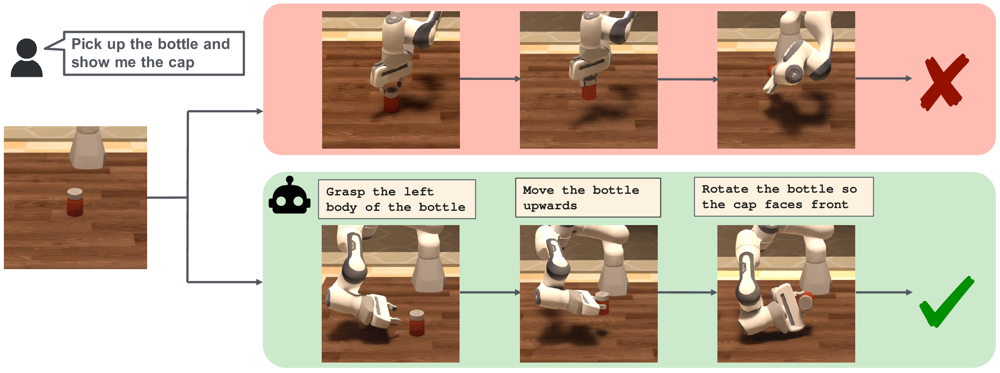

# PartInstruct

<a href="https://www.roboticsproceedings.org/rss21/p148.pdf"><strong>Paper</strong></a>
  |
<a href="https://partinstruct.github.io/"><strong>Project Page</strong></a>
  |
<a href="https://huggingface.co/datasets/SCAI-JHU/PartInstruct"><strong>Dataset</strong></a>

**Robotics: Science and Systems (RSS) 2025**



We introduce **PartInstruct**, the first large-scale benchmark for training and evaluating fine-grained robot manipulation policies using part-level instructions.

### Environment Setup 


```bash
git clone --recurse-submodules https://github.com/SCAI-JHU/PartInstruct.git
cd PartInstruct

conda create -n partinstruct -c conda-forge python=3.9 cmake=3.24.3 open3d ninja gcc_linux-64=12 gxx_linux-64=12
conda activate partinstruct

pip3 install torch torchvision torchaudio
```

Install third-party

```bash
pip install -r requirements.txt

pip install -e .
pip install -e ./third_party/pybullet_planning/
pip install -e ./third_party/diffusion_policy/
pip install -e ./third_party/3D-Diffusion-Policy/
pip install -e ./third_party/gym-0.21.0/
pip install -e ./third_party/pytorch3d_simplified/
pip install -e ./third_party/sam_2/
```

### Download Assets and Pretrained Checkpoints
Go to the dataset page: https://huggingface.co/datasets/SCAI-JHU/PartInstruct. Log in to your Hugging Face account and accept the conditions as prompted. Then go back to the project root directory, log in from your terminal.

```bash
huggingface-cli login
```
Enter your password. You can now download the assets. The following commands download and set up the assets under a created data/ directory.

```bash
huggingface-cli download SCAI-JHU/PartInstruct --repo-type dataset --local-dir ./data --include "*.json" "assets.zip" "checkpoints/**" 

#To download PartInstruct dataset in hdf5 format, add "demos/**" for all demo, "demos/OBJECT_NAME.hdf5" for demo of specific object type

unzip ./data/assets.zip -d ./data/ && rm data/assets.zip
```

Download checkpoints of SAM-2 (Use in Bi-level Planning)

```bash
cd ./third_party/sam_2/checkpoints/
bash download_ckpts.sh
cd ../../../
```

### Run Demos with Oracle Policy
This command will sample part-level manipulation tasks from the evaluation metadata and execute the tasks using an Oracle planner:
```bash
python scripts/run_oracle_policy.py
```

### Evaluate Code as Policies
To evaluate [Code as Policies](https://code-as-policies.github.io/) with GPT4o, use the following command to set up your OpenAI API key as an environmental variable:
```bash
export OPENAI_API_KEY=your_openai_api_key
```
Then run the following command:
```bash
python scripts/run_code_as_policies.py
```

### Evaluate Bi-level Planners

```bash
# Set the OpenAI key if haven't
export OPENAI_API_KEY=your_openai_api_key

# Run evaluation
# e.g. Run Evaluation with Diffusion Policy (DP-S), use groundtruth part-mask (bullet_env)
python PartInstruct/baselines/evaluation/evaluator.py \
    --config-name DP-S_evaluator \
    rollout_mode='specific_ckpt' \
    split='test1' \
    ckpt_path=PartInstruct/data/checkpoints/DP-S/latest.ckpt \
    output_dir=PartInstruct/outputs/DP-S \
    task.env_runner.bullet_env=PartInstruct.PartGym.env.bullet_env \
    task.env_runner._target_=PartInstruct.baselines.evaluation.env_runner.dp_env_runner.DPEnvRunner \
    task.env_runner.n_envs=1 \
    task.env_runner.n_vis=1
    
# e.g. Run Evaluation with Diffusion Policy (DP-S), use SAM 2 for part-mask (bullet_env_sam)
python PartInstruct/baselines/evaluation/evaluator.py \
    --config-name DP-S_evaluator \
    rollout_mode='specific_ckpt' \
    split='test1' \
    ckpt_path=PartInstruct/data/checkpoints/DP-S/latest.ckpt \
    output_dir=PartInstruct/outputs/DP-S \
    task.env_runner.bullet_env=PartInstruct.PartGym.env.bullet_env_sam \
    task.env_runner._target_=PartInstruct.baselines.evaluation.env_runner.dp_env_runner.DPEnvRunner \
    task.env_runner.n_envs=1 \
    task.env_runner.n_vis=1

# e.g. Run Evaluation with Diffusion Policy (DP-S), use bi-level framework (bullet_env_sam_gpt)
python PartInstruct/baselines/evaluation/evaluator.py \
    --config-name DP-S_evaluator \
    rollout_mode='specific_ckpt' \
    split='test1' \
    ckpt_path=PartInstruct/data/checkpoints/DP-S/latest.ckpt \
    output_dir=PartInstruct/outputs/DP-S \
    task.env_runner.bullet_env=PartInstruct.PartGym.env.bullet_env_sam_gpt \
    task.env_runner._target_=PartInstruct.baselines.evaluation.env_runner.dp_gpt_env_runner.GPTEnvRunner \
    task.env_runner.n_envs=1 \
    task.env_runner.n_vis=1

# For DP3-S, replace the DP-S to DP3-S
```

### Citation

If you find our work useful in your research, please consider citing:

```bibtex
@inproceedings{yin2025partinstruct,
	title={PartInstruct: Part-level Instruction Following for Fine-grained Robot Manipulation},
	author={Yin, Yifan and Han, Zhengtao and Aarya, Shivam and Xu, Shuhang and Wang, Jianxin and Peng, Jiawei and Wang, Angtian and Yuille, Alan and Shu, Tianmin},
	booktitle={Proceedings of Robotics: Science and Systems (RSS)},
	year={2025}
}
```
